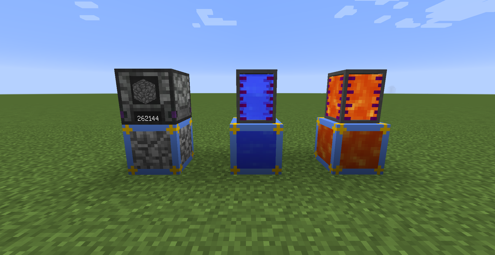
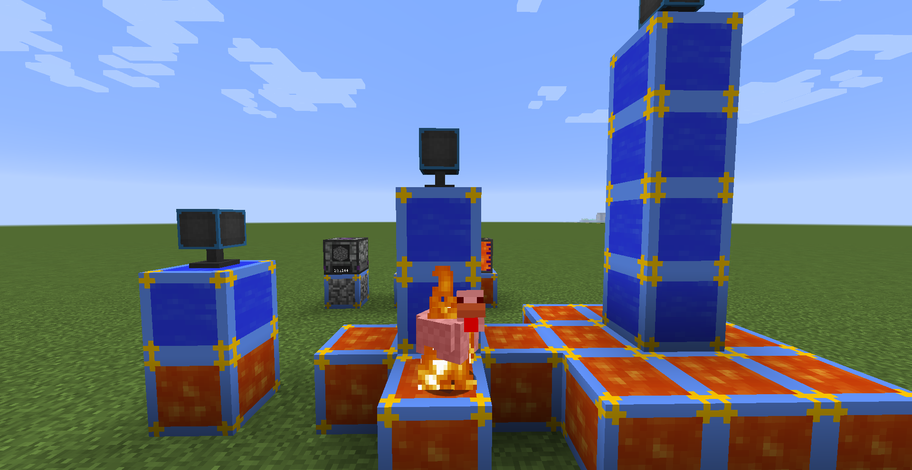
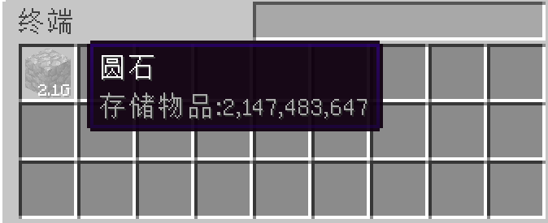
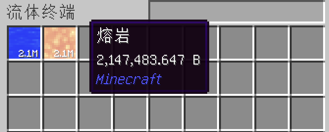

# 无限供应器 | Infinite Provider

[中文](#中文) | [English](#english) | [画廊Gallery](#画廊Gallery)

---

## 中文

### 📖 模组介绍

**无限供应器（Infinite Provider）** 是一个 Minecraft 1.12.2 Forge 模组，添加了三种无限资源供应器：圆石、水和岩浆。这些方块可以提供无限资源，并包含一个**发电系统**帮助玩家度过前期的发电尴尬期。

### ✨ 功能特性

#### 🧱 三种供应器类型

1. **无限圆石供应器**
   - 提供无限的圆石
   - **主动输出**：向相邻方块自动输出圆石，最大速率 `2.1G 个/t`
   - **输出机制**：检测到相邻方块可接收时激活，每 tick 输出；无接收时每秒检测一次
   - **手动交互**：
     - 左键点击：取出一个圆石（按住 Shift 左键取出一组）
     - 右键点击：放入圆石（双击右键放入背包所有圆石）

2. **无限水供应器**
   - 提供无限的水源
   - **主动输出**：向相邻方块自动输出水，最大速率 `2.1G mB/t`
   - **输出机制**：检测到相邻方块可接收时激活，每 tick 输出；无接收时每秒检测一次
   - **手动交互**：
     - 左键点击：用一个容器装满水（按住 Shift 左键填满整堆容器）
     - 右键点击：排空手持的水容器（双击右键排空背包所有水容器）
   - **被动交互**：实体站在上面会自动熄灭火焰
   - 发电系统的核心组件
   - 顶层水供应器向相邻方块输出能量

3. **无限岩浆供应器**
   - 提供无限的岩浆源
   - **主动输出**：向相邻方块自动输出岩浆，最大速率 `2.1G mB/t`
   - **输出机制**：检测到相邻方块可接收时激活，每 tick 输出；无接收时每秒检测一次
   - **手动交互**：
     - 左键点击：用一个容器装满岩浆（按住 Shift 左键填满整堆容器）
     - 右键点击：排空手持的岩浆容器（双击右键排空背包所有岩浆容器）
   - **被动交互**：实体站在上面会受到 2.0 点火焰伤害并被点燃 3 秒
   - 发电系统的底座
   - 支持集群摆放以获得发电加成

#### ⚡ 发电系统

使用水和岩浆供应器搭建垂直发电装置：

**建造方法：**
1. 在底部放置岩浆供应器作为底座
2. 在上方垂直堆叠水供应器
3. 系统会自动开始发电

**发电功率等级**（默认配置）：
- 1个水供应器：`256 RF/t`
- 2个水供应器：`512 RF/t`
- 3个水供应器：`768 RF/t`
- 4个水供应器：`1024 RF/t`
- 5个水供应器：`2048 RF/t`
- 6个水供应器：`4096 RF/t`
- 7个水供应器：`8192 RF/t`
- 8个及以上水供应器：`16384 RF/t`

**能量输出：**
- 能量存储容量：`2.1G RF`（Integer.MAX_VALUE）
- 最大输出速率：`2.1G RF/t`（Integer.MAX_VALUE）
- 输出方向：能量只从**顶层水供应器**输出

#### 🔥 岩浆集群加成

用不同的摆放方式来提升发电功率：

**集群摆放方式：**
1. **单个岩浆供应器**：`1.0x` 倍数（默认）
2. **十字形摆放（5个）**：`2.0x` 倍数（默认）
   - 中心1个，东南西北各1个
3. **3×3摆放（9个）**：`4.0x` 倍数（默认）
   - 完整的 3×3 正方形

**计算方式：**
- 最终功率 = 基础功率 × 集群倍数
- 示例：8个水供应器 + 3×3岩浆集群 = `16384 × 4.0 = 65536 RF/t`
- 如果不需要集群倍率可以在配置中禁用

### 🔧 配置选项

所有设置都可以在 `config/infinite_provider/generator.cfg` 中自定义：

**基础发电配置：**
- 调整每个等级（1-8+个水供应器）的发电功率

**岩浆集群加成：**
- 自定义单个、十字形和 3×3 集群的加成倍数
- 范围：0.1x 到 10.0x
- 启用/禁用集群检测

**能量存储：**
- 配置水供应器的能量容量
- 设置最大输出速率

### 💡 使用技巧

1. **查看详情**：将鼠标悬停在水/岩浆供应器上并按住 `Shift` 键可查看当前配置的详细发电信息

### 📋 前置需求

- Minecraft 1.12.2
- Forge 14.23.5.2847 或更高版本

### 📜 开源许可

本模组采用 [MIT 许可证](LICENSE) 开源。

---

## English

### 📖 Introduction

**Infinite Provider** is a Minecraft 1.12.2 Forge mod that adds three types of infinite resource providers: cobblestone, water, and lava. These blocks provide unlimited resources and include a **power generation system** to help players get through the early-game energy bottleneck.

### ✨ Features

#### 🧱 Three Provider Types

1. **Infinite Cobblestone Provider**
   - Provides infinite cobblestone
   - **Active Output**: Automatically outputs cobblestone to adjacent blocks, max rate `2.1G items/t`
   - **Output Mechanism**: Activates when adjacent blocks can receive, outputs every tick; checks once per second when idle
   - **Manual Interaction**:
     - Left-click: Extract one cobblestone (Shift + left-click to extract one stack)
     - Right-click: Insert cobblestone (double right-click to insert all cobblestone from inventory)

2. **Infinite Water Provider**
   - Provides infinite water source
   - **Active Output**: Automatically outputs water to adjacent blocks, max rate `2.1G mB/t`
   - **Output Mechanism**: Activates when adjacent blocks can receive, outputs every tick; checks once per second when idle
   - **Manual Interaction**:
     - Left-click: Fill one container with water (Shift + left-click to fill entire stack of containers)
     - Right-click: Empty held water container (double right-click to empty all water containers from inventory)
   - **Passive Interaction**: Walking on it automatically extinguishes fire on entities
   - Core component of the power generation system
   - Outputs energy to adjacent blocks from the top provider

3. **Infinite Lava Provider**
   - Provides infinite lava source
   - **Active Output**: Automatically outputs lava to adjacent blocks, max rate `2.1G mB/t`
   - **Output Mechanism**: Activates when adjacent blocks can receive, outputs every tick; checks once per second when idle
   - **Manual Interaction**:
     - Left-click: Fill one container with lava (Shift + left-click to fill entire stack of containers)
     - Right-click: Empty held lava container (double right-click to empty all lava containers from inventory)
   - **Passive Interaction**: Walking on it deals 2.0 fire damage and sets entities on fire for 3 seconds
   - Acts as the base for the power generation system
   - Supports cluster patterns for power bonuses

#### ⚡ Power Generation System

Build a vertical power generator using water and lava providers:

**How to Build:**
1. Place a lava provider as the base
2. Stack water providers vertically on top of it
3. The system will automatically start generating power

**Power Output Levels** (Default Configuration):
- 1 Water Provider: `256 RF/t`
- 2 Water Providers: `512 RF/t`
- 3 Water Providers: `768 RF/t`
- 4 Water Providers: `1024 RF/t`
- 5 Water Providers: `2048 RF/t`
- 6 Water Providers: `4096 RF/t`
- 7 Water Providers: `8192 RF/t`
- 8+ Water Providers: `16384 RF/t`

**Energy Output:**
- Energy Storage: `2.1G RF` (Integer.MAX_VALUE)
- Maximum Output: `2.1G RF/t` (Integer.MAX_VALUE)
- Output Direction: Energy is output from the **top water provider** only

#### 🔥 Lava Cluster Bonus

Arrange lava providers in different patterns to increase power generation:

**Cluster Patterns:**
1. **Single Lava Provider**: `1.0x` multiplier (default)
2. **Cross Pattern (5 providers)**: `2.0x` multiplier (default)
   - One center provider with four adjacent providers (north, south, east, west)
3. **3×3 Grid (9 providers)**: `4.0x` multiplier (default)
   - A complete 3×3 square of lava providers

**Calculation:**
- Final power = Base power × Cluster multiplier
- Example: 8 water providers + 3×3 lava cluster = `16384 × 4.0 = 65536 RF/t`
- Can be disabled in configuration if not needed

#### 🔧 Configuration

All settings can be customized in `config/infinite_provider/generator.cfg`:

**Basic Power Generation:**
- Adjust power output for each tier (1-8+ water providers)

**Lava Cluster Bonuses:**
- Customize bonus multipliers for single, cross, and 3×3 clusters
- Range: 0.1x to 10.0x
- Toggle cluster detection on/off

**Energy Storage:**
- Configure energy capacity for water providers
- Set maximum output rate

### 💡 Tips & Tricks

1. **View Details**: Hover over water/lava providers and hold `Shift` to view detailed power generation information based on current configuration

### 📋 Requirements

- Minecraft 1.12.2
- Forge 14.23.5.2847 or higher

### 📜 License

This mod is licensed under the [MIT License](LICENSE).

---

## 画廊Gallery

|  |  |
|-----------------------|-----------------------|
|  |  |

---

### 🛠️ For Developers

This mod is built with [CleanroomMC/ForgeDevEnv](https://github.com/CleanroomMC/ForgeDevEnv):
- **Java 25**
- **Gradle 9.2.1**
- **RetroFuturaGradle 2.0.2**
- **Forge 14.23.5.2847**
